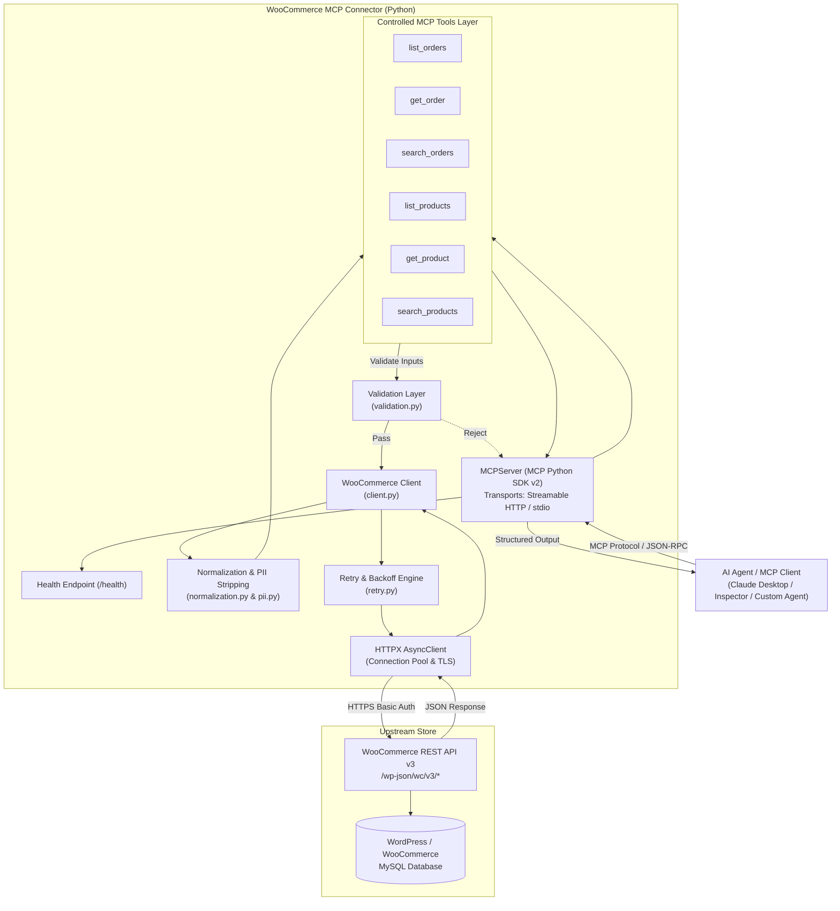

# WooCommerce MCP Connector — System Architecture

This document describes the architectural design, security boundaries, request flow, and design rationale of the WooCommerce Private MCP Connector.

---

## 1. System Architecture Diagram

---

## 2. Request & Execution Flow

1. **Client Request**: An AI Agent or MCP client invokes an MCP tool (e.g. `list_orders(page=1, limit=20, status='processing')`) over the Streamable HTTP (`POST /mcp`) or `stdio` transport.
2. **Schema & Argument Inspection**: The `MCPServer` matches the requested tool and dispatches parameters to the registered async function.
3. **Connector Input Validation**:
   - `validation.py` validates argument constraints (e.g. `limit` between 1 and 100, `order_id > 0`, `status` in official WooCommerce statuses).
   - If invalid, execution halts immediately with `ErrorCode.INVALID_INPUT` without making an external request.
4. **Client Layer Dispatch**: `WooCommerceClient` prepares the request targeting `/wp-json/wc/v3/<endpoint>` with query parameters.
5. **Resilient HTTP Execution**:
   - Requests are executed through `execute_with_retry`.
   - If upstream returns HTTP 429, 500, 502, 503, 504 or network errors, exponential backoff with jitter is applied.
   - If `Retry-After` header is present on HTTP 429, it is parsed and honored (bounded by `max_delay`).
   - If HTTP 400, 401, 403, or 404 is received, the loop aborts immediately without wasteful retries.
6. **Data Minimization & PII Stripping**:
   - `pii.py` strips customer billing addresses, shipping addresses, phone numbers, emails, and notes.
7. **Response Normalization**:
   - `normalization.py` converts raw JSON into structured Pydantic models (`OrderSummary`, `ProductSummary`).
   - Pagination headers (`X-WP-Total`, `X-WP-TotalPages`) are extracted into `PaginationMetadata`.
8. **MCP Response Delivery**:
   - Normalized results are wrapped in `BaseResponse.ok(...)` and returned to the client as dual text and structured content.

---

## 3. Module Responsibilities

| Module | Responsibility |
| :--- | :--- |
| `config.py` | Loads and validates environment variables (`WOOCOMMERCE_URL`, `WOOCOMMERCE_CONSUMER_KEY`, etc.); enforces URL sanitization and masks credentials in string outputs. |
| `models.py` | Pydantic data models for normalized entities (`OrderSummary`, `ProductSummary`, `OrderItem`, `ProductCategory`), pagination metadata, error codes, and standardized envelopes. |
| `validation.py` | Connector-side validation rules (positive integer IDs, pagination safety boundaries, order status enumeration, ISO 8601 timestamps, search field whitelists). |
| `pii.py` | Data minimization logic that strips sensitive customer identifying information and redacts secrets from logger output. |
| `normalization.py` | Transforms raw WooCommerce payloads into normalized models and parses WooCommerce pagination headers. |
| `retry.py` | Bounded retry engine supporting exponential backoff, randomized jitter, and standard `Retry-After` parsing. |
| `client.py` | Read-only asynchronous HTTP client managing connection pooling, TLS, HTTP Basic Authentication, and status-to-error mappings. |
| `server.py` | MCP Server factory using official MCP Python SDK v2 (`MCPServer`), tool registrations, `/health` endpoint, and CLI entrypoint. |

---

## 4. Key Architectural & Security Decisions

### 1. Why There is No Database
* **Statelessness**: The connector operates as a transparent, stateless security and translation proxy between the LLM and the e-commerce store.
* **Consistency**: WooCommerce remains the single source of truth for stock quantities and order statuses. Local storage would introduce cache invalidation discrepancies.
* **Simplicity**: Avoids database connection pooling, schema migrations, and operational failure modes.

### 2. Why There Are No Write Tools
* **Safety by Construction**: The connector is strictly read-only.
* **Blast Radius Mitigation**: AI models can hallucinate or misinterpret user intent. Preventing write operations at the code level guarantees that an agent can never modify inventory, alter prices, create bogus orders, or delete store records.

### 3. Why Arbitrary Endpoints Are Prohibited
* **Perimeter Defense**: Exposing a generic `raw_request` or `call_endpoint` tool would turn the connector into an open proxy.
* **Privilege Escalation**: Prompt injection attacks could exploit generic tools to query WordPress internal APIs (e.g. `/wp-json/wp/v2/users`) or access private plugin endpoints.

### 4. Direct HTTPX Integration
* **Async Performance**: Uses `httpx.AsyncClient` with connection reuse and keep-alive.
* **Standardized Protocol**: Directly calls official WooCommerce REST API v3 without intermediary third-party SDK dependencies that may lag behind modern Python or async standards.
